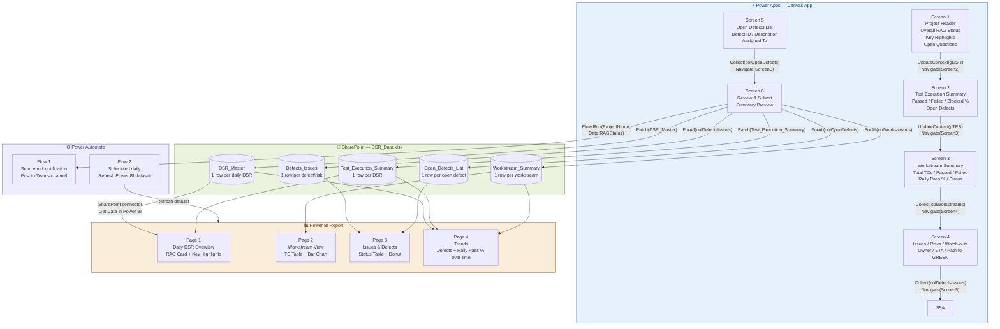

# DSR Automation — System Flow

```mermaid
flowchart TD
    subgraph PA["⚡ Power Apps — Canvas App"]
        S1["Screen 1\nProject Header\nOverall RAG Status\nKey Highlights\nOpen Questions"]
        S2["Screen 2\nTest Execution Summary\nPassed / Failed / Blocked %\nOpen Defects"]
        S3["Screen 3\nWorkstream Summary\nTotal TCs / Passed / Failed\nRally Pass % / Status"]
        S4["Screen 4\nIssues / Risks / Watch-outs\nOwner / ETA / Path to GREEN"]
        S5["Screen 5\nOpen Defects List\nDefect ID / Description\nAssigned To"]
        S6["Screen 6\nReview & Submit\nSummary Preview"]

        S1 -->|"UpdateContext(gDSR)\nNavigate(Screen2)"| S2
        S2 -->|"UpdateContext(gTES)\nNavigate(Screen3)"| S3
        S3 -->|"Collect(colWorkstreams)\nNavigate(Screen4)"| S4
        S4 -->|"Collect(colDefectsIssues)\nNavigate(Screen5)"| S5A
        S5 -->|"Collect(colOpenDefects)\nNavigate(Screen6)"| S6
    end

    subgraph SP["📁 SharePoint — DSR_Data.xlsx"]
        T1[("DSR_Master\n1 row per daily DSR")]
        T2[("Test_Execution_Summary\n1 row per DSR")]
        T3[("Workstream_Summary\n1 row per workstream")]
        T4[("Defects_Issues\n1 row per defect/risk")]
        T5[("Open_Defects_List\n1 row per open defect")]
    end

    subgraph AUTO["⚙️ Power Automate"]
        F1["Flow 1\nSend email notification\nPost to Teams channel"]
        F2["Flow 2\nScheduled daily\nRefresh Power BI dataset"]
    end

    subgraph PBI["📊 Power BI Report"]
        P1["Page 1\nDaily DSR Overview\nRAG Card + Key Highlights"]
        P2["Page 2\nWorkstream View\nTC Table + Bar Chart"]
        P3["Page 3\nIssues & Defects\nStatus Table + Donut"]
        P4["Page 4\nTrends\nDefects + Rally Pass % over time"]
    end

    S6 -->|"Patch(DSR_Master)"| T1
    S6 -->|"Patch(Test_Execution_Summary)"| T2
    S6 -->|"ForAll(colWorkstreams)"| T3
    S6 -->|"ForAll(colDefectsIssues)"| T4
    S6 -->|"ForAll(colOpenDefects)"| T5
    S6 -->|"Flow.Run(ProjectName,\nDate,RAGStatus)"| F1

    F2 -->|"Refresh dataset"| PBI

    T1 -->|"SharePoint connector\nGet Data in Power BI"| P1
    T2 --> P1
    T3 --> P2
    T4 --> P3
    T5 --> P3
    T1 --> P4
    T2 --> P4
    T3 --> P4

    style PA fill:#E6F1FB,stroke:#185FA5,color:#0C447C
    style SP fill:#EAF3DE,stroke:#3B6D11,color:#27500A
    style AUTO fill:#EEEDFE,stroke:#534AB7,color:#3C3489
    style PBI fill:#FAEEDA,stroke:#854F0B,color:#633806
```
