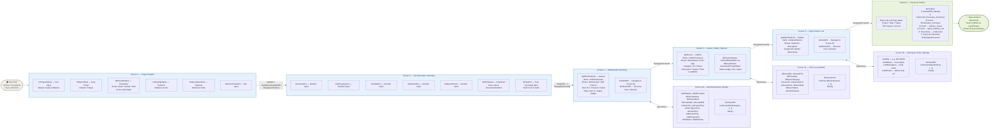

# DSR Power Apps — Screen Design & Navigation

```mermaid
flowchart LR
    HOME(["🏠 App Start\nOnStart: Set globals\nClear collections"])

    HOME --> S1

    subgraph S1["Screen 1 — Project Header"]
        direction TB
        S1A["txtProjectName — Text Input\nDefault: User().FullName"]
        S1B["dtReportDate — Date Picker\nDefault: Today()"]
        S1C["ddOverallStatus — Dropdown\nItems: Green / Amber / Red\nColor-coded label"]
        S1D["txtKeyHighlights — TextArea\nMultiLine mode"]
        S1E["txtOpenQuestions — TextArea\nMultiLine mode"]
        S1F["txtDefectSuiteRef — Text Input"]
    end

    subgraph S2["Screen 2 — Test Execution Summary"]
        direction TB
        S2A["txtPassedPct — Number Input"]
        S2B["txtInProgressPct — Number Input"]
        S2C["txtFailedPct — Number Input"]
        S2D["txtBlockedPct — Number Input"]
        S2E["txtOpenDefects — Number Input"]
        S2F["ddTESStatus — Dropdown\nColor-coded: Green/Amber/Red"]
        S2G["lblTotalPct — Auto-calculated label\nSUM of all % fields"]
    end

    subgraph S3["Screen 3 — Workstream Summary"]
        direction TB
        S3A["galWorkstreams — Gallery\nItems: colWorkstreams\nShows: Workstream / E2E Feature\nTotal TCs / Passed / Failed\nRally Pass % / Status badge"]
        S3B["btnAddWS → Navigate to Screen 3b\nbtnDeleteWS → Remove from collection"]
    end

    subgraph S3B_MODAL["Screen 3b — Add Workstream (Modal)"]
        direction TB
        S3C["txtWSName, txtE2EFeature\ndtPlannedStart, dtPlannedEnd\ndtActualStart, dtActualEnd\ntxtTotalTCs, txtPassedTCs\ntxtInProgressTCs, txtFailedTCs\ntxtBlockedTCs, txtWSOpenDef\ntxtRallyPct, ddWSStatus"]
        S3D["btnSaveWS:\nCollect(colWorkstreams, {...})\nBack()"]
    end

    subgraph S4["Screen 4 — Issues / Risks / Defects"]
        direction TB
        S4A["galIssues — Gallery\nItems: colDefectsIssues\nShows: Workstream / ETA / App\nCategory / ID / Owner\nDescription / Status / Path to GREEN"]
        S4B["ddIssueCategory: Defect/Risk/Watch-out\nddIssueStatus: Submitted/Closed/Open\nStatus badge color-coded"]
    end

    subgraph S4B_MODAL["Screen 4b — Add Issue (Modal)"]
        direction TB
        S4C["ddIssueWS, txtIssueETA\nddIssueApp, ddIssueCategory\ntxtIssueID, txtIssueOwner\ntxtIssueDesc, dtIssueDate\nddIssueStatus, txtPathToGreen"]
        S4D["btnSaveIssue:\nCollect(colDefectsIssues, {...})\nBack()"]
    end

    subgraph S5["Screen 5 — Open Defects List"]
        direction TB
        S5A["galOpenDefects — Gallery\nItems: colOpenDefects\nShows: DefectID / Description\nAssignedTo (bold) / DefectSuite"]
        S5B["btnAddOD → Navigate to Screen 5b\nbtnDeleteOD → Remove from collection"]
    end

    subgraph S5B_MODAL["Screen 5b — Add Open Defect (Modal)"]
        direction TB
        S5C["txtODID — e.g. DE730035\ntxtODDesc — description\ntxtODAssignee — bold name\ntxtODSuite — defect suite ref"]
        S5D["btnSaveOD:\nCollect(colOpenDefects, {...})\nBack()"]
    end

    subgraph S6["Screen 6 — Review & Submit"]
        direction TB
        S6A["Read-only summary labels\nProject / Date / Status\nTES metrics / Counts"]
        S6B["btnSubmit:\n① Patch(DSR_Master)\n② Patch(Test_Execution_Summary)\n③ ForAll → Workstream_Summary\n④ ForAll → Defects_Issues\n⑤ ForAll → Open_Defects_List\n⑥ Flow.Run() — notify team\n⑦ Clear all collections\n⑧ Navigate(Screen1)"]
    end

    DONE(["✅ Data saved to SharePoint\nTeam notified via email/Teams\nPower BI auto-refreshes"])

    S1 -->|"Validate + UpdateContext(gDSR)\nNavigate(Screen2)"| S2
    S2 -->|"Set(gTES,...)\nNavigate(Screen3)"| S3
    S3 -->|"Navigate(Screen4)"| S4
    S3 <-->|"Open/close"| S3B_MODAL
    S4 -->|"Navigate(Screen5)"| S5
    S4 <-->|"Open/close"| S4B_MODAL
    S5 -->|"Navigate(Screen6)"| S6
    S5 <-->|"Open/close"| S5B_MODAL
    S6 --> DONE

    style S1 fill:#E6F1FB,stroke:#185FA5,color:#0C447C
    style S2 fill:#E6F1FB,stroke:#185FA5,color:#0C447C
    style S3 fill:#E6F1FB,stroke:#185FA5,color:#0C447C
    style S3B_MODAL fill:#EEEDFE,stroke:#534AB7,color:#3C3489
    style S4 fill:#E6F1FB,stroke:#185FA5,color:#0C447C
    style S4B_MODAL fill:#EEEDFE,stroke:#534AB7,color:#3C3489
    style S5 fill:#E6F1FB,stroke:#185FA5,color:#0C447C
    style S5B_MODAL fill:#EEEDFE,stroke:#534AB7,color:#3C3489
    style S6 fill:#EAF3DE,stroke:#3B6D11,color:#27500A
    style HOME fill:#F1EFE8,stroke:#888780,color:#444441
    style DONE fill:#EAF3DE,stroke:#3B6D11,color:#27500A
```
