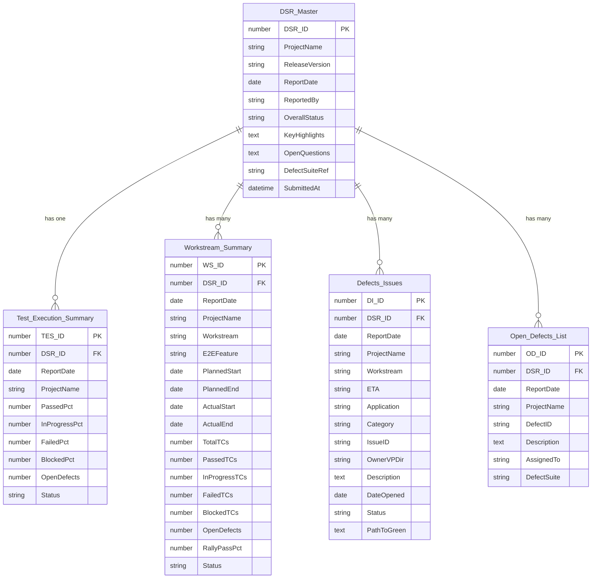

# DSR Automation — Excel Data Model (SharePoint)

```mermaid
erDiagram
    DSR_Master {
        number DSR_ID PK
        string ProjectName
        string ReleaseVersion
        date ReportDate
        string ReportedBy
        string OverallStatus
        text KeyHighlights
        text OpenQuestions
        string DefectSuiteRef
        datetime SubmittedAt
    }

    Test_Execution_Summary {
        number TES_ID PK
        number DSR_ID FK
        date ReportDate
        string ProjectName
        number PassedPct
        number InProgressPct
        number FailedPct
        number BlockedPct
        number OpenDefects
        string Status
    }

    Workstream_Summary {
        number WS_ID PK
        number DSR_ID FK
        date ReportDate
        string ProjectName
        string Workstream
        string E2EFeature
        date PlannedStart
        date PlannedEnd
        date ActualStart
        date ActualEnd
        number TotalTCs
        number PassedTCs
        number InProgressTCs
        number FailedTCs
        number BlockedTCs
        number OpenDefects
        number RallyPassPct
        string Status
    }

    Defects_Issues {
        number DI_ID PK
        number DSR_ID FK
        date ReportDate
        string ProjectName
        string Workstream
        string ETA
        string Application
        string Category
        string IssueID
        string OwnerVPDir
        text Description
        date DateOpened
        string Status
        text PathToGreen
    }

    Open_Defects_List {
        number OD_ID PK
        number DSR_ID FK
        date ReportDate
        string ProjectName
        string DefectID
        text Description
        string AssignedTo
        string DefectSuite
    }

    DSR_Master ||--o{ Test_Execution_Summary : "has one"
    DSR_Master ||--o{ Workstream_Summary : "has many"
    DSR_Master ||--o{ Defects_Issues : "has many"
    DSR_Master ||--o{ Open_Defects_List : "has many"
```
